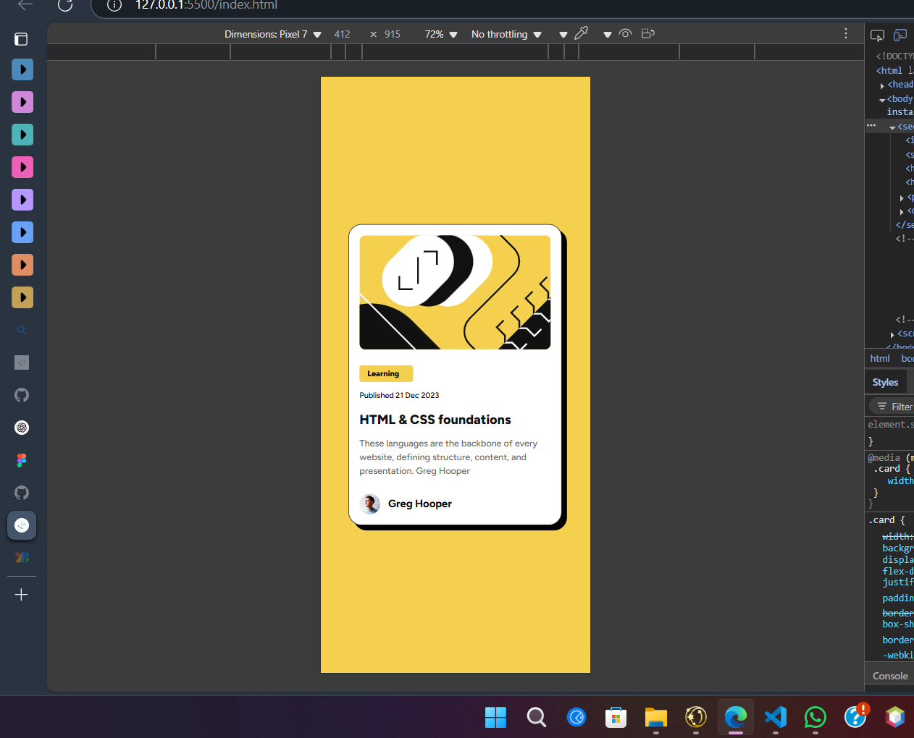
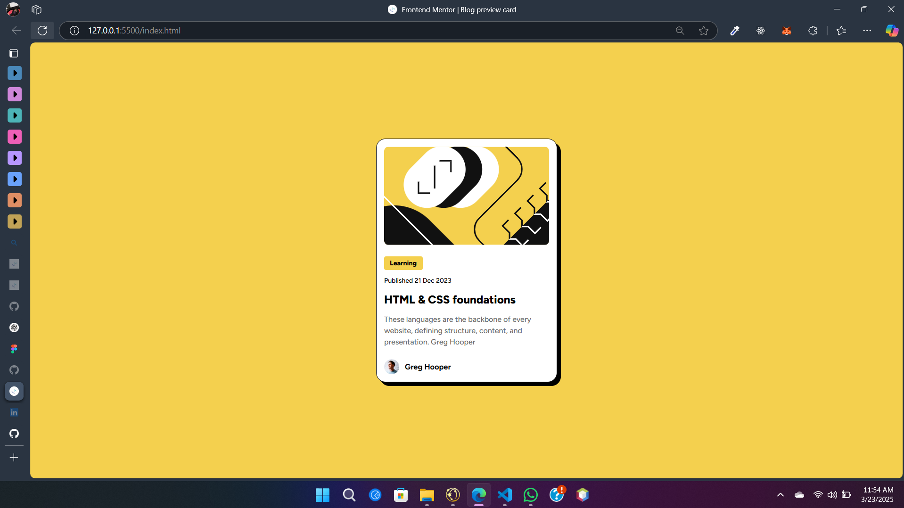
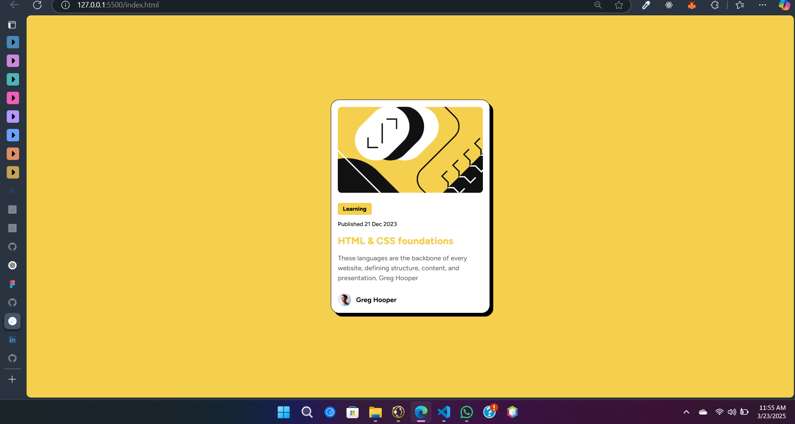

```markdown
# Frontend Mentor - Blog Preview Card Solution

This is a solution to the [Blog preview card challenge on Frontend Mentor](https://www.frontendmentor.io/challenges/blog-preview-card-ckPaj01IcS). Frontend Mentor challenges help you improve your coding skills by building realistic projects.

## Table of contents

- [Overview](#overview)
  - [The challenge](#the-challenge)
  - [Screenshot](#screenshot)
  - [Links](#links)
- [My process](#my-process)
  - [Built with](#built-with)
  - [What I learned](#what-i-learned)
  - [Continued development](#continued-development)
- [Author](#author)
- [Acknowledgments](#acknowledgments)

## Overview

### The challenge

Users should be able to:

- See hover and focus states for all interactive elements on the page.

### Screenshot





### Links

- Solution URL: [Add solution URL here](https://your-solution-url.com)
- Live Site URL: [Add live site URL here](https://your-live-site-url.com)

## My process

### Built with

- Semantic HTML5 markup
- CSS custom properties
- Flexbox

### What I learned

Throughout this project, I focused on creating a clean layout using Flexbox and CSS Grid. I also learned how to style a hover effect for interactivity. For example:

```html
<h1>HTML & CSS foundations</h1>
```

```css
h1:hover {
  color: var(--yelllow);
}
```


### Continued development

For future projects, I plan to continue improving my responsiveness and accessibility skills, as well as exploring animations to enhance user experience. 


## Author

- Github - [Md. Fardin Khan](https://github.com/KPorus)
- Linkedin - [Md. Fardin Khan](https://www.linkedin.com/in/fardinkhan121199/)
- Frontend Mentor - [@KPorus](https://www.frontendmentor.io/profile/KPorus)
- Twitter - [@yourusername](https://www.twitter.com/yourusername)

## Acknowledgments

Thanks to Frontend Mentor for the awesome challenge and to all the people who helped me improve my skills during this project.
```